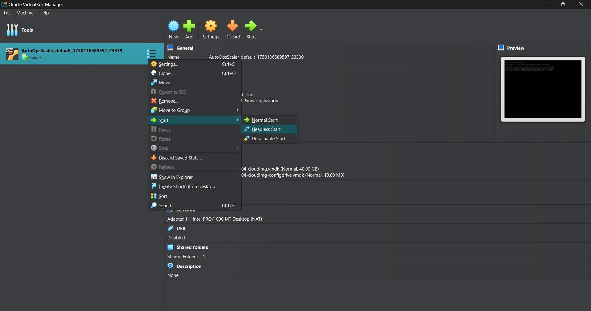
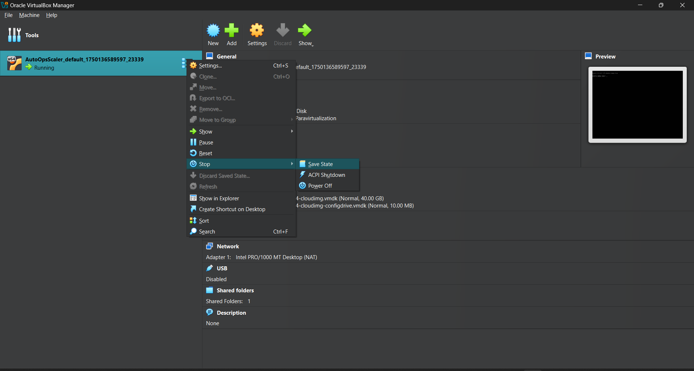

# **AutoOpsScaler — A LowOps environment to implement the #1 GenAI scaling statergy**

## KubeRay on EKS + Karpenter is the leading production strategy for highly scalable, cost-effective GenAI clusters.
| **Aspect**                           | **KubeRay on EKS + Karpenter**                                        | **Alternatives (summary)**                                                                         |
| ------------------------------------ | --------------------------------------------------------------------- | -------------------------------------------------------------------------------------------------- |
| **Node provisioning latency**        | Sub‑minute: just‑in‑time EC2 nodes on unschedulable Ray pods          | 2–5 min boot (Cluster Autoscaler, EC2, Fargate); instant but opaque (serverless)                   |
| **GPU flexibility & fractional use** | Any EC2 GPU (A10G/A100/H100); Ray supports fractional scheduling      | Predefined pools(EKS-Auto), no fractional (EKS CA); limited SKUs (GKE); no GPU (Fargate)                     |
| **Spot + On‑Demand cost mix**        | Optimized Spot usage with fallback; Ray handles preemptions           | Slower rebalancing (CA); extra fees (EKS‑Auto); manual Spot handling (EC2); high cost (serverless) |
| **Observability & debugging**        | Full: Kubernetes events, Ray Dashboard, Prometheus                    | Limited logs (managed Ray services); less verbose (CA); manual scripts (EC2)                       |
| **Operational overhead**             | Minimal: single Karpenter CRD + RayService, basic IAM policies        | Multiple CRDs/HPA/KEDA/CA rules; custom EC2 scripts; YAML bloat                                    |
| **Self‑healing**                     | Automatic node replacement and Ray task restarts                      | Slower node recovery (CA); manual scripts (EC2); vendor dependent (serverless)                     |
| **Use‑case suitability**             | Top choice: LLM training, fine‑tuning, batch inference, RAG pipelines | Prototype only (serverless); stateless services (ECS); DIY clusters (bare‑metal)                   |

---
### Known Limitation: The only significant limitation is that **KubeRay depends on Kubernetes control-plane stability and Karpenter’s Spot capacity**.  In rare cases of severe Spot market volatility, On-Demand fallback may slightly increase costs.  This is standard for any Spot-based scaling strategy and can be mitigated with well-tuned capacity pools and fallback rules.

---

## **AutoOpsScaler** significantly reduces the manual complexity by providing a declarative, fully automated backend for KubeRay on EKS + Karpenter and a self-hosted AI stack to run production workloads from day one.

- **Provisions infrastructure:** VPC, EKS, Karpenter, IAM, networking  
- **Configures Ray clusters:** fractional GPU scheduling, Serve, Train, Data components  
- **Self-hosts AI stack:** LLM models, embedding models, self managed postgres(zalando), and a vector database(qdrant) — all deployed in your cluster  
- **Enables safe autoscaling:** sub-minute GPU scaling with Spot fallback  
- **Provides observability:** Ray Dashboard, Prometheus, Kubernetes events  
- **Reduces YAML overhead:** no custom HPA, KEDA, or Cluster Autoscaler scripts

---

## Run a Fully Self-Hosted GenAI Backend

With **AutoOpsScaler**, you can deploy and operate your own LLMs, embeddings, vector search, and RAG pipelines on your AWS account — with production-grade cost efficiency and without needing deep Kubernetes or Ray expertise.

# **AutoOpsScaler Architecture:**

```py
AutoOpsScaler/
|── base_configs/                       # Declarative source‑of‑truth configs for core infrastructure
|   ├── iam.yml                         # Defines IAM roles, policies, and trust relationships
|   ├── vpc.yml                         # Specifies VPC CIDRs, subnets, NAT gateways, and Internet Gateway
|   ├── eks.yml                         # Configures EKS cluster settings and base node groups
|   ├── karpenter.yml                   # Defines Karpenter Provisioner settings and Spot capacity pools
|   ├── observability.yml               # Prometheus, Grafana, and Alertmanager deployment settings
|   ├── secrets.yml                     # Template for Secrets Manager entries or external ARNs
|   ├── zalando_operator.yml            # Zalando Postgres Operator CRD and database cluster spec
|   ├── qdrant.yml                      # Qdrant StatefulSet, EBS PVC, and Service manifest
|   ├── ingress.yml                     # Traefik IngressRoutes and Middleware definitions
|   └── README.md                       # Guidelines for writing and validating config files

|── base_infra/                         # Pulumi modules for validating configs and provisioning infra
|   ├── 01_iam/
|   │   ├── __main__.py                 # Loads & validates iam.yml, provisions IAM roles/policies
|   │   └── iam.py                      # Helper functions for IAM resource definitions
|   ├── 02_vpc/
|   │   ├── __main__.py                 # Loads & validates vpc.yml, provisions VPC, subnets, and IGW
|   │   └── vpc.py                      # Helper functions for VPC and networking setup
|   ├── 03_eks/
|   │   ├── __main__.py                 # Loads & validates eks.yml, provisions EKS cluster & nodegroups
|   │   └── eks.py                      # Helper functions for EKS resource creation
|   ├── 04_karpenter/
|   │   ├── __main__.py                 # Loads & validates karpenter.yml, deploys Karpenter CRDs
|   │   └── karpenter.py                # Helper functions for Karpenter Provisioner logic
|   ├── 05_observability/
|   │   ├── __main__.py                 # Loads & validates observability.yml, deploys monitoring stack
|   │   └── observability.py            # Helper functions for Prometheus/Grafana deployment
|   ├── 06_secrets/
|   │   ├── __main__.py                 # Loads & validates secrets.yml, provisions Secrets Manager entries
|   │   └── secrets.py                  # Helper functions for secrets handling
|   ├── 07_zalando_operator/
|   │   ├── __main__.py                 # Loads & validates zalando_operator.yml, installs Postgres Operator
|   │   └── zalando_operator.py         # Helper logic for Zalando Operator and CRDs
|   ├── 08_qdrant/
|   │   ├── __main__.py                 # Loads & validates qdrant.yml, deploys Qdrant StatefulSet & PVC
|   │   └── qdrant.py                   # Helper functions for Qdrant resource management
|   └── 09_ingress/
|       ├── __main__.py                 # Loads & validates ingress.yml, deploys Traefik IngressRoutes
|       └── ingress.py                  # Helper functions for Traefik Ingress configuration
|
|── pulumi.yaml                         # Pulumi project metadata: name, runtime, and backend
|── Pulumi.prod.yaml                    # Production stack config: region, cluster name, scaling limits
|── Makefile                            # Unified commands for validate, build, and deploy workflows
|
|── utils/                              # Shared utility functions and helpers
|   ├── README.md                       # Documentation for utility modules
|   ├── __init__.py                     # Marks the utils directory as a Python package
|   ├── config_loader.py                # Loads and merges layered configs from base_configs/
|   ├── deduplicator.py                 # Implements SHA‑256 based deduplication for data files
|   ├── logger.py                       # Centralized structured logging setup
|   └── s3_util.py                      # Helper functions for S3 upload/download with boto3
|
|── storage/                            # Local mirror of S3 bucket structure for syncing
|   ├── data/
|   │   ├── raw/                        # Original, unprocessed data files
|   │   ├── processed/
|   │   │   ├── chunked/               # Text chunks after preprocessing
|   │   │   └── parsed/                # Parsed documents from raw files
|   │   └── db_backups/
|   │       ├── qdrant_backups/        # Qdrant database snapshot files
|   │       └── postgres_backups/      # Postgres database dump files
|   └── observability/                 # Local snapshots of monitoring data
|
|── ELT/                                # Extract‑Load‑Transform pipeline (CPU‑based RayJob)
|   ├── modules/                       # Python modules for extraction, loading, and parsing
|   │   ├── __init__.py                 # Declares ELT.modules as a Python package
|   │   ├── extract_load/               # Raw ingestion into S3 for downstream pipelines
|   │   │   ├── __init__.py             # Declares extract_load as a subpackage
|   │   │   ├── file_watcher.py         # Watches local/S3 folders; triggers uploads
|   │   │   ├── llamaindex_loader.py    # Uses LlamaIndex to load and dedupe documents
|   │   │   ├── s3_uploader.py          # Uploads raw files to S3 with boto3
|   │   │   ├── web_scraper.py          # Scrapy+Playwright scraper with deduplication logic
|   │   │   ├── Dockerfile              # Builds ELT container image with Ray and Prefect
|   │   │   ├── requirements.txt        # Python dependencies for ELT container
|   │   │   └── README.md               # Workflow docs: extract and load stages
|   │   ├── data_preprocessing/         # Parses and chunks raw data for vectorization
|   │   │   ├── __init__.py             # Declares data_preprocessing as a subpackage
|   │   │   ├── chunker_llamaindex.py   # Splits text into chunks; records latency metrics
|   │   │   ├── doc_parser.py           # Parses files with unstructured.io; logs tracing info
|   │   │   ├── filters.py              # Filters out noise; tracks retention ratios
|   │   │   ├── format_normalizer.py    # Cleans text metadata; logs standardization stats
|   │   │   ├── html_parser.py          # HTML parsing via trafilatura; logs malformed docs
|   │   │   ├── Dockerfile              # Builds preprocessing container image with Prefect
|   │   │   ├── requirements.txt        # Python dependencies for preprocessing container
|   │   │   └── README.md               # Docs: parsing heuristics and chunking strategies
|   ├── app-elt.argocd.yaml             # Argo CD manifest for ELT pipeline deployment
|   ├── DynamicRayJobGenerator.py       # Generates Ray Job CRD specs at runtime
|   ├── ELT_config.yml                  # Central config file for ELT pipeline stages
|   └── main.py                         # Orchestrates ELT stages via Prefect flows/tasks
|
|── indexing/                           # Embedding pipeline (GPU‑based RayJob)
|   ├── modules/                       # Python modules for batch embedding and metadata
|   │   ├── __init__.py                 # Declares embedding.modules as a Python package
|   │   ├── batch_embed.py              # Prefect flow for batch embedding with metrics
|   │   ├── main.py                    # Entrypoint: orchestrates embedding via Prefect
|   │   ├── model_loader.py             # Loads and caches SentenceTransformer models
|   │   ├── insert_metadata.py          # Persists document metadata into Postgres
|   │   ├── embed_to_qdrant.py          # Pushes embeddings to Qdrant; logs latency/stats
|   │   ├── worker.py                   # Task-level embedding logic emitting performance spans
|   │   ├── Dockerfile                  # Builds embedding container with Prefect and Ray libs
|   │   └── requirements.txt            # Python dependencies for embedding container
|   ├── app-embedding.argocd.yaml       # Argo CD manifest for embedding pipeline
|   └── DynamicRayJobGenerator.py       # Generates Ray Job specs dynamically at runtime
|
|
|── inference_pipeline/                 # Production ready pipelines for RAG, eval, and API
|   ├── rag/                            # Core RAG orchestration with integrated evaluation
|   │   ├── Dockerfile                  # Container image build for RAG + eval flows
|   │   ├── requirements.txt            # Python dependencies for RAG + eval container
|   │   ├── DynamicRayServiceGenerator.py# Dynamically creates Ray Service specs for RAG cluster
|   │   ├── app-rag.argocd.yaml         # ArgoCD manifest for RAG and evaluation services
|   │   ├── main.py                     # Entrypoint: runs Prefect flows for RAG and eval
|   │   └── modules/                    # RAG internal modules for retrieval, generation, and metrics
|   │       ├── __init__.py             # Declares rag.modules as a Python package
|   │       ├── generator.py            # Invokes LLMs; logs token usage and model details
|   │       ├── agent.py                # Simple ReAct agent for better retreival
|   │       ├── retriever.py            # Vector DB search and chunk retrieval logic
|   │       ├── eval_pipeline.py        # Quality evaluation pipeline using RAGAS/trulens or custom metrics
|   │       └── ragas_wrapper.py        # Adapter for invoking RAGAS/trulens evaluation and tracing APIs
|   |   
|   └── api/                           # User-facing API and web interface
|       ├── frontend/                  # React frontend application for RAG interaction
|       │   ├── DynamicRayServiceGenerator.py# Generates Ray Service specs for frontend
|       │   ├── Dockerfile             # Builds frontend using Vite and React
|       │   ├── requirements.txt       # Node/Python dependencies for frontend container (if any)
|       │   ├── vite.config.ts         # Vite configuration for development and production
|       │   ├── index.html             # HTML template for mounting React app
|       │   ├── package.json           # Frontend dependencies and build scripts
|       │   └── src/                   # Frontend source files
|       │       ├── main.tsx           # App entry point mounting the root component
|       │       ├── App.tsx            # Root React component with routing logic
|       │       ├── api.ts             # Axios client configured with Postgres JWT auth
|       │       ├── components/        # Reusable UI component library
|       │       │   ├── Header.tsx     # Top navigation bar component
|       │       │   └── FileUploader.tsx# Drag‑and‑drop file uploader component
|       │       ├── pages/             # Routed page components
|       │       │   ├── Search.tsx     # Semantic search UI and logic
|       │       │   ├── Generate.tsx   # LLM prompt submission and display
|       │       │   └── Login.tsx      # User login page with Postgres JWT authentication
|       │       └── styles/            # Global styling resources
|       │           └── main.css       # Application‑wide CSS or Tailwind configuration
|       └── backend/                  # FastAPI backend serving frontend and orchestration APIs
|           ├── Dockerfile            # Builds backend container with FastAPI and Prefect client
|           ├── requirements.txt      # Python dependencies for backend container
|           ├── DynamicRayServiceGenerator.py# Generates Ray Serve specs for backend
|           ├── app-api.argocd.yaml    # ArgoCD manifest for backend deployment
|           ├── __init__.py            # Declares backend as a Python package
|           ├── main.py                # FastAPI entrypoint registering all routes
|           ├── dependencies/          # Shared modules: config, auth, ORM schemas
|           │   ├── __init__.py        # Declares dependencies as a Python module
|           │   ├── config.py          # Loads env vars, DB URI, and application settings
|           │   ├── auth_postgres.py   # JWT validation against Postgres session store
|           │   └── tables/            # SQLAlchemy ORM models for database tables
|           │       ├── __init__.py    # Declares tables as a Python subpackage
|           │       ├── user.py        # 'User' model schema and helper methods
|           │       ├── session.py     # 'Session' model for JWT sessions and expiry
|           │       ├── feedback.py    # 'Feedback' model for user ratings and corrections
|           │       └── query_log.py   # 'QueryLog' model for auditing and analytics
|           └── routes/                # FastAPI route handlers grouped by feature
|               ├── __init__.py        # Declares routes as a module
|               ├── embedding.py       # Embeddings generation endpoint
|               ├── generate.py        # LLM generation endpoint
|               ├── health.py          # Health and readiness probes
|               ├── job.py             # Endpoints for triggering background jobs
|               └── search.py          # Semantic search query endpoint
|
|── tests/                                # Test suite for all components
|   ├── __init__.py                       # Marks tests as a Python module
|   ├── conftest.py                       # Shared pytest fixtures and mock clients
|   ├── test_api.py                       # Unit tests for API endpoints
|   ├── test_embedding.py                 # Tests for embedding workflows and model loading
|   ├── test_ingestion.py                 # Tests for extract-load logic and S3 uploads
|   ├── test_rag.py                       # Tests for RAG retriever and generator modules
|   ├── test_vector.py                    # Tests for Qdrant upsert and query operations
|   └── env_check.sh                      # Script to verify CLI tools and environment health
|
|── .github/                              # GitHub Actions workflows
|   └── workflows/
|       └── ci.yml                        # CI pipeline: lint, tests, and Makefile integration
|── scripts/                              # Essential scripts like login.sh, install.sh,..etc
|── docs/                                 # Docs about infra, archtecture, configs, troubleshooting ,etc
|── README.md                             # High‑level architecture, setup, and usage guide
|── requirements.txt                      # Pinned Python dependencies for Ubuntu 22.04 environment

```


# **AutoOpsScaler — Quick Start**

### **Prerequisite:**

A full Linux setup is required (do **not** use Docker Desktop, WSL,devcontainers).

---

## **One-time installation prerequisites**

| Windows                                                                                                              | macOS/Linux                                                        |
| -------------------------------------------------------------------------------------------------------------------- | ------------------------------------------------------------------ |
| [Visual Studio Code](https://code.visualstudio.com/) *(required)*                                                    | [Visual Studio Code](https://code.visualstudio.com/) *(required)*  |
| [Visual C++ Redistributable](https://learn.microsoft.com/en-us/cpp/windows/latest-supported-vc-redist?view=msvc-170) | *(not required)*                                                   |
| [Git](https://git-scm.com/downloads)                                                                                 | [Git](https://git-scm.com/downloads)                               |
| [Vagrant 2.4.3](https://developer.hashicorp.com/vagrant/downloads)                                                   | [Vagrant 2.4.3](https://developer.hashicorp.com/vagrant/downloads) |
| [VirtualBox](https://www.virtualbox.org/wiki/Downloads)                                                              | [VirtualBox](https://www.virtualbox.org/wiki/Downloads)            |

> **Note:** If the latest VirtualBox version has compatibility issues with Vagrant 2.4.3, use [VirtualBox 7.0.14](https://download.virtualbox.org/virtualbox/7.0.14/).

---

## **Restart your system and get started**

> Open a **Git Bash** terminal and run the following command. The first run may take longer as the Ubuntu Jammy VM box will be downloaded.

```bash
cd $HOME && git config --global core.autocrlf false && git clone https://github.com/Athithya-Sakthivel/AutoOpsScaler.git && cd AutoOpsScaler && vagrant up && bash ssh.sh
```

---

## **Connecting via Visual Studio Code (Alternative method)**

1. Run `vagrant up` (if the VM is not already running).
2. Open Visual Studio Code on your local machine.
3. Install the **Remote - SSH** extension (if not already installed).
4. Click the green icon in the lower-left corner, or press `Ctrl+Shift+P` and select **Remote-SSH: Connect to Host**.
5. Choose **`AutoOpsScaler`** from the list.
6. When prompted for the platform, select **Linux** (the VM runs Linux).

To open the project in VS Code, run:

```bash
cd /vagrant/ && code .
```

---

## **Important: VM Lifecycle**

 ### **After a system reboot**, the VM will be shut down. Always start it manually before connecting from VS Code:

  * Open VirtualBox → Right-click the VM → **Start → Headless Start**

  

### **Optionally, you can save the VM state before shutting down your system for faster resumption:**

  * Open VirtualBox → Right-click the VM → **Close → Save State**

  


